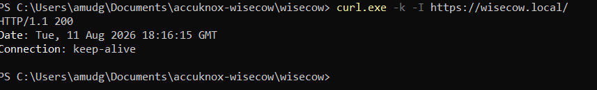
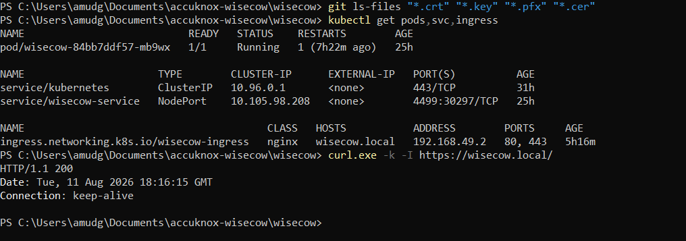
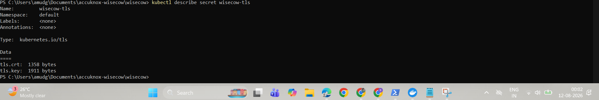
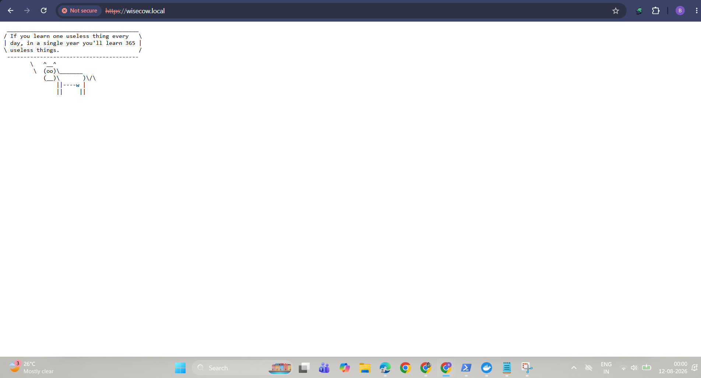

# Wisecow – Kubernetes Deployment with Docker, CI/CD and TLS

Wisecow is a simple web application that displays random cow wisdom.

This project demonstrates the complete containerization and deployment of the
Wisecow application using Docker and Kubernetes, along with a Kubernetes
Service, NGINX Ingress, secure HTTPS/TLS communication, GitHub Actions CI/CD,
and additional DevOps automation scripts.

---

## Assignment Objective

The objective of this project is to containerize and deploy the Wisecow
application on a Kubernetes environment with secure TLS communication and
automated Docker image builds.

---

# Problem Statement 1 – Containerization and Kubernetes Deployment

## Requirements Implemented

### 1. Dockerization

A custom `Dockerfile` has been created to containerize the Wisecow application.

The Docker image installs the required dependencies and runs the Wisecow
application on port `4499`.

### 2. Kubernetes Deployment

The application has been deployed on a Minikube Kubernetes cluster using:

- Kubernetes Deployment
- Kubernetes Service
- NGINX Ingress
- TLS Secret

The Wisecow application is exposed through a Kubernetes Service and routed
through the NGINX Ingress Controller.

### 3. CI/CD with GitHub Actions

A GitHub Actions workflow has been implemented to automatically build the
Docker image whenever changes are pushed to the repository.

The workflow also pushes the generated image to GitHub Container Registry
(GHCR).

### 4. Secure TLS Communication

HTTPS has been configured using an NGINX Ingress resource and a Kubernetes
TLS Secret.

The application is accessible through:

`https://wisecow.local/`

TLS communication was verified successfully using `curl`.

---

# Technologies Used

- Docker
- Kubernetes
- Minikube
- NGINX Ingress Controller
- GitHub Actions
- GitHub Container Registry (GHCR)
- TLS / HTTPS
- Bash
- Python
- Ubuntu / Linux tools

---

# Project Structure

```text
wisecow/
│
├── .github/
│   └── workflows/
│       └── docker-build.yml
│
├── screenshots/
│   ├── Https_redirect.png
│   ├── https-endpoint-verification.png
│   ├── kubernetes-resources-and-tls-verification.png
│   ├── tls-secret-verification.png
│   └── wisecow-browser.png
│
├── Dockerfile
├── deployment.yaml
├── service.yaml
├── ingress.yaml
├── wisecow.sh
│
├── health_checker.py
├── log_analyzer.py
├── sample_access.log
│
├── .gitignore
├── LICENSE
└── README.md
```

---

# Docker

The application is containerized using the provided Dockerfile.

Build the image locally:

```bash
docker build -t wisecow:1.0 .
```

Run the container:

```bash
docker run -p 4499:4499 wisecow:1.0
```

The application runs on:

```text
http://localhost:4499
```

---

# Kubernetes Deployment

The Kubernetes resources can be deployed using:

```bash
kubectl apply -f deployment.yaml
kubectl apply -f service.yaml
kubectl apply -f ingress.yaml
```

Verify the deployment:

```bash
kubectl get pods
kubectl get services
kubectl get ingress
```

Expected resources include:

```text
Deployment: wisecow
Service: wisecow-service
Ingress: wisecow-ingress
```

---

# Kubernetes Service

The Wisecow application is exposed using a Kubernetes Service.

Service configuration:

```text
Service Port: 4499
```

The Service forwards traffic to the Wisecow application running inside the
Kubernetes Pod.

---

# TLS / HTTPS Configuration

NGINX Ingress has been configured to provide HTTPS access to the application.

The TLS configuration uses a Kubernetes TLS Secret named:

```text
wisecow-tls
```

The Ingress host is:

```text
wisecow.local
```

HTTPS endpoint:

```text
https://wisecow.local/
```

TLS Secret verification:

```bash
kubectl describe secret wisecow-tls
```

The TLS certificate and private key are intentionally not committed to the
repository.

---

# HTTPS Verification

HTTPS connectivity was verified using:

```bash
curl.exe -k -I https://wisecow.local/
```

Successful response:

```text
HTTP/1.1 200
```

This confirms that the application is reachable through the HTTPS endpoint.

---

# GitHub Actions CI/CD

The GitHub Actions workflow is located at:

```text
.github/workflows/docker-build.yml
```

The workflow automatically builds the Docker image when changes are pushed
to the repository.

The generated image is published to GitHub Container Registry (GHCR).

The workflow provides automated container image creation and registry
publishing as part of the CI/CD pipeline.

---

# GitHub Container Registry

The Docker image is published to GitHub Container Registry.

The repository contains the workflow responsible for building and publishing
the image.

This allows the Kubernetes deployment to consume a versioned container image
from a container registry.

---

# Problem Statement 2 – DevOps Automation Scripts

Two objectives were implemented using Python.

## 1. Application Health Checker

File:

```text
health_checker.py
```

The health checker verifies whether an application is reachable and
functioning correctly by checking its HTTP response.

Example:

```bash
python health_checker.py
```

The script reports:

```text
Application Health Check

URL: <application-url>
Status: UP
```

If the application cannot be reached, it reports:

```text
Status: DOWN
```

The script can be adapted to monitor any HTTP/HTTPS application endpoint.

---

## 2. Log File Analyzer

File:

```text
log_analyzer.py
```

The log analyzer processes web server access logs and generates a summary
containing:

- Total requests
- HTTP status code summary
- Number of 404 errors
- Most requested pages
- Top client IP addresses

Example:

```bash
python log_analyzer.py sample_access.log
```

Example output:

```text
# Wisecow Log Analysis Report

Log file: sample_access.log
Total requests: 12

HTTP Status Summary:
200: 9
404: 3

404 errors: 3

Most Requested Pages:
/: 5
/missing: 3
/about: 2
/api/status: 2

Top Client IPs:
192.168.1.10: 5
192.168.1.11: 3
192.168.1.12: 2
192.168.1.13: 1
192.168.1.14: 1
```

---

# Assignment Evidence / Screenshots

Screenshots demonstrating the implementation and verification are available
in the [`screenshots/`](screenshots/) directory.

## GitHub Actions



## Kubernetes Resources and TLS Verification



## TLS Secret Verification



## HTTPS Endpoint Verification


## Wisecow Browser



---

# Verification Commands

Useful commands used during deployment and verification:

### Check Kubernetes resources

```bash
kubectl get pods,svc,ingress
```

### Check TLS Secret

```bash
kubectl describe secret wisecow-tls
```

### Check Ingress

```bash
kubectl get ingress
```

### Verify HTTPS

```bash
curl.exe -k -I https://wisecow.local/
```

Expected result:

```text
HTTP/1.1 200
```

---

# Security Considerations

The TLS certificate and private key are not stored in Git.

TLS-related secret files are excluded through `.gitignore`.

This prevents sensitive private key material from being accidentally committed
to the public repository.

---

# Challenge Goals

The following challenge goals were addressed:

- [x] Docker containerization
- [x] Kubernetes deployment
- [x] Kubernetes Service
- [x] NGINX Ingress
- [x] HTTPS / TLS
- [x] GitHub Actions CI/CD
- [x] Docker image publishing to GHCR
- [x] Application health checking
- [x] Web log analysis
- [x] Deployment verification
- [x] Evidence screenshots

---

# Problem Statement 3 – Optional KubeArmor

KubeArmor policy implementation was treated as an optional challenge goal.

The primary assignment requirements have been implemented and verified through
the Kubernetes deployment, CI/CD workflow, TLS configuration, health checker,
log analyzer, and supporting screenshots.

---

# Conclusion

The Wisecow application has been successfully containerized using Docker and
deployed on Kubernetes using Minikube.

The application is exposed through a Kubernetes Service and NGINX Ingress,
with HTTPS/TLS enabled for secure communication.

GitHub Actions automates Docker image building and publishing to GitHub
Container Registry.

Additional Python-based DevOps utilities were implemented for application
health monitoring and web log analysis.

The repository contains the application, Dockerfile, Kubernetes manifests,
CI/CD workflow, automation scripts, sample log data, and deployment evidence.